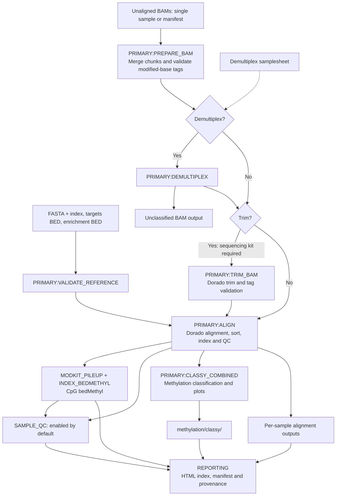
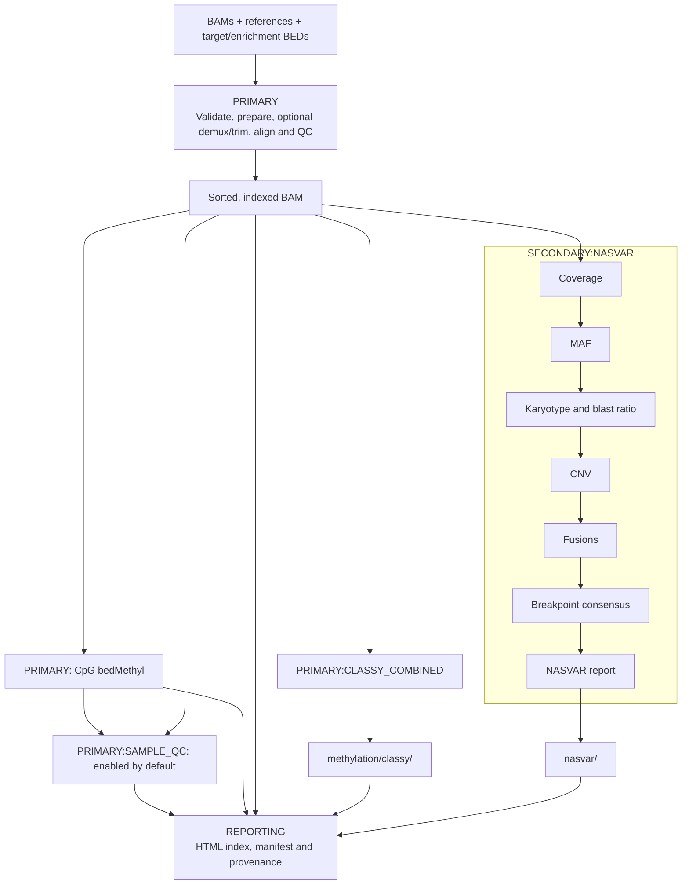
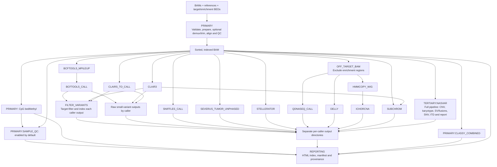

# FrankONTstein

A Nextflow DSL2 workflow for **tumor-only Oxford Nanopore adaptive sampling**, assembled from commit-pinned oncoseq modules and NASVAR, with local adapters where their interfaces need to change.

Development release: workflow routing and BAM integrity checks are tested. Containerized biological analyses and Slurm/AWS execution still require representative integration validation before a release is declared validated.

## Analysis tiers

| Option | Analyses |
| --- | --- |
| `--primary` (default) | Alignment, comprehensive QC, CpG bedMethyl and Classy methylation classification |
| `--secondary` | Primary plus NASVAR coverage, MAF, karyotype, CNVs, fusions and breakpoint consensus |
| `--tertiary` | Primary plus the complete NASVAR pipeline and compatible oncoseq callers |

Task names preserve analysis hierarchy: `PRIMARY:ALIGN` and `PRIMARY:CLASSY_COMBINED`
in all modes; `SECONDARY:NASVAR` in secondary mode; `TERTIARY:NASVAR` and
`TERTIARY:CALLING:...` in tertiary mode. Shared publishing uses `REPORTING:...`.

Choose at most one tier. Tertiary exposes `nasvar,bcftools,clair3,clairsto,sniffles,severus,stellerator,qdnaseq,delly,subchrom,ichorcna`. Use `--callers nasvar,sniffles` to narrow its defaults. Selecting SubChrom adds its Clair3 prerequisite. Secondary permits only NASVAR; primary has no variant callers. Classy remains enabled in all tiers.

Both **hg38/GRCh38** and **hs1/CHM13** are supported reference choices. CHM13 defaults exclude QDNAseq, SubChrom and ichorCNA; explicitly selecting one fails. Other caller assets must match the exact assembly version in your bundle.

### Primary: alignment and methylation

Optional demultiplexing and trimming are bypassed when disabled. Reference
validation gates alignment; input preparation can run alongside it.



### Secondary: primary plus NASVAR CNV and SV analysis

The primary block below includes the complete preparation and alignment flow
above. NASVAR subcommands run sequentially inside one `SECONDARY:NASVAR` task;
Classy runs independently once alignment finishes.



### Tertiary: full analysis stack

This shows the default hg38 caller set; `--callers` can narrow it. QDNAseq,
SubChrom and ichorCNA are excluded on CHM13. Each caller retains separate results;
target filtering runs separately for each small-variant output, without merging
calls. NASVAR executes its full pipeline once, including SNV and ITD analysis.



Caller nodes other than NASVAR belong to `TERTIARY:CALLING`. Step-specific
reference assets and software-version channels are omitted from these diagrams
for readability.

## CpG output and QC

All tiers produce indexed CpG bedMethyl under `methylation/` and an integrated
sample QC report under `qc/`, linked from the root HTML index. QC includes input
yield, alignment, on/off-enrichment read lengths and coverage, target coverage,
and CpG depth/beta distributions. Coverage is reported at both MAPQ ≥0 and ≥20.
Use `--disable-qc true` to skip the new QC suite while retaining bedMethyl and
Classy. See [QC definitions and large-BAM execution](documentation/qc.md).

## Setup

The workflow uses syntax compatible with Nextflow's strict v2 parser, the default
in Nextflow 26. CI targets 25.10.2 (with `NXF_SYNTAX_PARSER=v2`) and 26.04.6.
The pinned upstream modules are imported without modifying their checkouts.

Requirements: Nextflow 26.04.6 (tested; 25.10.2 with the strict parser also supported), Java 17–25 supported by your Nextflow release, Python 3.10+, and Docker (local) or Apptainer (Slurm). Analysis images initially target Linux x86-64. An Apple Silicon host can run orchestration tests, but is not a validated production analysis platform.

```bash
git clone https://github.com/dbuckleychla/FrankONTstein.git
cd FrankONTstein
python3 bin/bootstrap.py
python3 bin/check_dependencies.py
```

Do **not** use unrestricted recursive submodule initialization: the pinned oncoseq tree contains a stale `sturgeon` gitlink and duplicate historical metadata. Bootstrap initializes only the modules in `dependencies.json`, at their gitlink commits.

Prepare a local image lock and a reference bundle using [the container guide](docs/containers.md) and [the reference guide](docs/references.md). No fake production image digests or redistributable classifier weights are supplied. `tests/fixtures/images.json` is exclusively for container-free contract tests.

## Run

See [run examples](documentation/run-examples.md) for all tiers, trimming,
demultiplexing, batches, resume, Slurm and AWS commands. See the
[AWS Terraform architecture](documentation/terraform-architecture.md) for the
Batch, networking, storage and coordinator diagram.

For a reusable reference configuration, copy `assets/references.example.yaml` to
`references.yaml` and
replace the example paths. Supply `--bam`, `--genome`, and `--sample_id` on the
command line. Shared reference inputs (`fasta`, `targets_bed`, `enrichment_bed`)
are top-level parameters in the file; analysis-specific assets live under
`steps.nasvar`, `steps.clairsto`, etc. Launch with:

```bash
nextflow run . -profile local,docker -params-file references.yaml \
  --bam /data/sample.ubam --genome hg38 --sample_id sample1 \
  --secondary --outdir results/sample1
```

The FASTA index defaults to `<fasta>.fai`; it must already exist. Relative paths
for references and the image lock resolve from the workflow directory containing
`main.nf` (`projectDir`), not the launch directory or YAML directory. No separate bundle is
required. Existing `--reference_bundle` runs remain supported, but cannot be
combined with `fasta`, `fai`, or `steps` parameters.

NASVAR's reference JSON and pediatric leukemia pipeline config are selected
by genome build from its pinned source. No preset option or separate JSON
download is needed. Use `steps.nasvar.config` or `steps.nasvar.reference` only
when overriding those defaults for your panel or reference.

Both BED inputs are **required in every tier**:

- `--enrichment_bed`: regions used for adaptive-sampling enrichment.
- `--targets_bed`: target genes/regions of interest, without enrichment padding where appropriate for NASVAR.

```bash
nextflow run . -profile local,docker \
  --bam /data/sample.ubam --sample_id sample1 \
  --reference_bundle /references/hg38/bundle.json \
  --enrichment_bed /panels/enrichment.bed --targets_bed /panels/targets.bed \
  --image_manifest images.lock.json --secondary --outdir results
```

For optional GPU POD5 input, see [basecalling](documentation/basecalling.md). Singleton and multiplexed POD5 runs feed into the same analysis tiers.

Input BAMs must be **unaligned**, basecalled with modified-base calls, and contain valid MM/ML tags. The workflow validates these tags, aligns through Dorado's minimap2-backed aligner, and validates the aligned BAM's modification encoding. Missing tags and stale MN coordinates fail; ordinary FASTQ conversion is not used. Alignment does not perform an exhaustive input/output read comparison or create a SQLite database.

`check_bam.py` uses each task's allocated CPUs for bounded parallel MM/ML decoding,
with one BAM reader and the remaining CPUs as workers. Every read is checked;
no sampling is used. For standalone checks, use
`python3 bin/check_bam.py sample.bam --unaligned --threads 8`.
The default standalone setting (`--threads 1`) keeps serial execution.

For multiple samples or BAM chunks, replace `--bam/--sample_id` with `--input samples.csv`:

```csv
sample,run,bam
sample1,run1,/data/sample1.part1.bam
sample1,run1,/data/sample1.part2.bam
sample2,run2,s3://your-bucket/sample2.bam
```

Paths in a sample CSV are relative to the launch directory or absolute/S3 paths. Reference-bundle paths are relative to the bundle. Multiple chunks for a sample are merged before alignment. Duplicate input paths are rejected. Sample/run IDs permit letters, digits, dots, underscores and hyphens, starting with a letter or digit.

For pooled BAMs, the input's `sample` identifies the pool; provide `--demux_samplesheet demux.csv`:

```csv
experiment_id,kit,barcode,alias
run1,SQK-NBD114-24,barcode01,sample1
run1,SQK-NBD114-24,barcode02,sample2
```

`experiment_id` must match the input manifest’s `run` (or `--sample_id` for a direct pooled BAM/POD5 input). `alias` determines output sample names; the sequencer’s `sample_id` does not override it. Only `experiment_id`, `kit`, `barcode`, and `alias` are required. Other columns, including `position_id`, `flow_cell_id`, `sample_id`, `flow_cell_product_code`, and `type`, are optional and ignored for routing. See [the full sequencer-sheet example](assets/demux.csv). Older `run,kit,barcode,sample` demux sheets must rename `run` to `experiment_id` and `sample` to `alias`.

Every run must have one kit and unique barcode-to-sample mappings. A sample may occur only once in the demultiplexing sheet in this release. Unclassified BAMs are retained under `demultiplex/`. A requested barcode with no output or no modification-tagged reads fails explicitly; it is never silently reassigned to another sample.

Demultiplexing precedes trimming. Add `--trim --sequencing_kit KIT_NAME` for
Dorado trimming. With `--demux_samplesheet`, the kit comes from each run's `kit`
column instead. Preflight rejects trimming without a kit before analysis starts.
Trimming is off by default. Data basecalled with barcodes already removed may not
be demultiplexable.

## Execution and outputs

- Local: `-profile local,docker`; cap resources with `--max_cpus` and `--max_memory`.
- Slurm: `-profile slurm,apptainer --slurm_queue QUEUE --slurm_account ACCOUNT`. Launch from a persistent host with shared work/reference storage. Configure the Apptainer cache outside job scratch.
- AWS: see [portable Terraform and launch instructions](docs/aws.md). The coordinator runs on your own persistent host; tasks run on AWS Batch.

Use `-c site.config` for site resource overrides. Processes use CPU execution by default; optional POD5 basecalling requires explicit GPU configuration. Do not assign GPUs to Dorado demux/trim/align merely because Dorado also supports GPU basecalling.

Alignment, Clair3, ClairS-TO, Sniffles, Severus and Stellerator request 16 CPUs
and 32 GB by default. Classy requests 8 CPUs/8 GB; NASVAR requests 8 CPUs/32 GB.
Requests respect `--max_cpus` and `--max_memory`; memory can increase on retry.
These resource tiers do not change the configured Slurm/AWS queue. NASVAR's CPU
allocation does not imply that every subcommand uses all eight cores.
Other processes retain their defaults; bcftools compression threads do not make
its core variant-calling computation fully parallel.

Outputs include per-sample `alignment/`, `methylation/classy/` and caller directories; caller-specific JSON/VCF/BCF/plots; `index.html`; `manifest.json`; and `pipeline_info/` with task status, trace, versions and execution reports. NASVAR outputs go directly under `<sample>/nasvar/`, with no duplicate under `variants/`. ichorCNA and SubChrom outputs likewise sit directly under their caller directories. Alignment includes flagstat QC; demultiplexed BAMs sit under `demultiplex/<run>/`. NASVAR's native JSON and HTML are preserved. Small-variant VCFs are also restricted to `--targets_bed` and indexed; raw caller VCFs remain available. The workflow does not merge competing callers into consensus calls.

QDNAseq, Delly and ichorCNA use reads not overlapping enrichment regions for broad CNV analysis. SubChrom uses its panel mode, your panel bins, and Clair3 output. These supplementary results need assay-specific validation; NASVAR is the primary adaptive-sampling analysis.

Resume with the same inputs, image lock, working directory and `.nextflow/` state:

```bash
nextflow run . -resume -profile local,docker -params-file references.yaml \
  --bam /data/sample.ubam --genome hg38 --sample_id sample1 \
  --secondary --outdir results/sample1
```

Keep distinct output directories for unrelated runs. Retain task work files until you no longer need resume. `pipeline_info/status.json` is the authoritative run-level completion status; a failed run may still have completed sample artifacts.

## Development and validation

```bash
python3 -m unittest discover -s tests -v
python3 tests/run_contracts.py
terraform -chdir=terraform/aws fmt -check
terraform -chdir=terraform/aws init -backend=false
terraform -chdir=terraform/aws validate
```

Install `pysam` to include real BAM integrity tests. Contract tests use stub data and mock caller executables, exercise all tiers and resume, and never validate biological accuracy. [Validation requirements](docs/validation.md) distinguish these tests from real tool/backend tests.

See [AGENTS.md](AGENTS.md) for module interfaces and dependency-update rules. Add custom processes under `modules/local/` and orchestration under `subworkflows/local/`, updating the tier resolver, reference requirements, image lock and tests together.

## License

Original workflow code is MIT. **NASVAR is non-commercial**, including when redistributed in a container; its full notice is retained in `licenses/NASVAR.txt`. Upstream modules, tools, models and reference assets retain their own terms. See [THIRD_PARTY_NOTICES.md](THIRD_PARTY_NOTICES.md).

Clair3 uses bundled models selected by `--basecall_model sup|hac|fast` (default `sup`), also configurable as `basecall_model: sup` in the params YAML. Following oncoseq, SUP selects `/opt/models/r1041_e82_400bps_sup_v500`; HAC and FAST select `/opt/models/r1041_e82_400bps_hac_v500`. These assume R10.4.1 E8.2, 400 bps data. No external model path is required; old `steps.clair3.model` entries are ignored.
