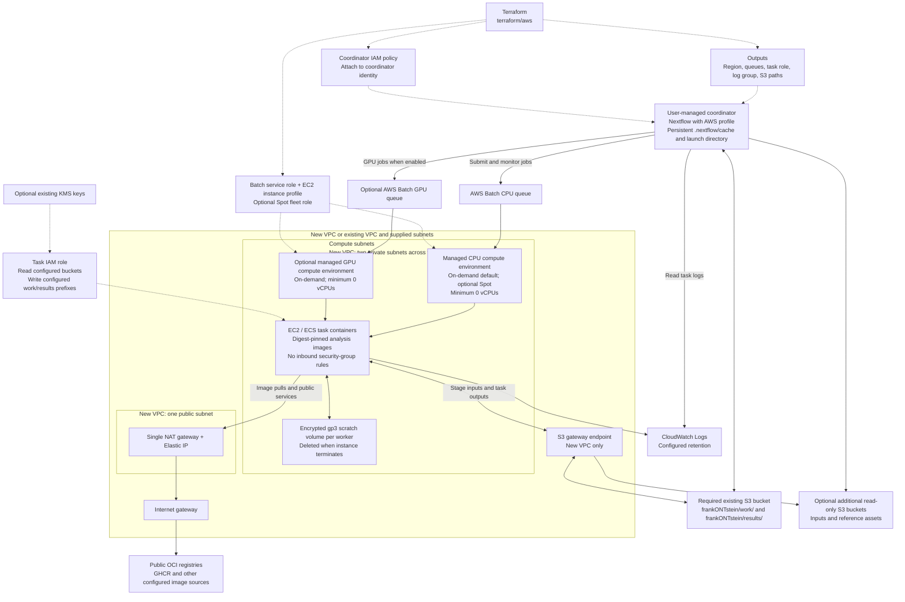

# AWS Terraform architecture

The configuration in [`terraform/aws`](../terraform/aws/) provisions AWS Batch
workers and supporting infrastructure. Nextflow runs on a **user-managed,
persistent coordinator host**; Terraform does not create that host. Solid arrows
show job or data flow; dotted arrows show configuration and permissions.

## Networking and storage choices

- **New VPC:** Terraform creates two private compute subnets, a public subnet,
  one NAT gateway, an internet gateway, routing and an S3 gateway endpoint.
  Private workers use the NAT for public image pulls and other public services;
  regional S3 traffic uses the gateway endpoint.
- **Existing VPC:** supply `vpc_id` and `subnet_ids`. Terraform creates the Batch
  security group but does not create NAT, routes or endpoints. The supplied
  network must provide outbound access to registries and required AWS services.
- **Existing bucket required:** Terraform only looks it up; it never creates,
  deletes or changes bucket settings. Encryption, policies, versioning, lifecycle
  and retention stay with the bucket owner. The default `s3_prefix` is
  `frankONTstein/`; writes/cleanup are limited to its `work/` and `results/`
  paths. Additional input buckets can be granted read access.
- **Upgrades:** migration blocks forget old managed bucket/settings resources
  without changing AWS. Apply the reviewed migration before teardown; see the
  [AWS guide](../docs/aws.md#upgrading-an-existing-terraform-state).

The GPU queue exists only when `gpu_instance_types` is configured. CPU Spot is
optional; the GPU environment remains on-demand. Both environments can scale to
zero, but NAT gateway, storage, logs and any coordinator host still incur costs.
The new VPC uses a single NAT gateway, so outbound connectivity depends on that
availability zone and traffic from the other zone can incur cross-AZ charges.

See [AWS CLI and Terraform permissions](aws-cli-permissions.md) for the deployment
action inventory, runtime policy scopes, and profile-check commands.

## Coordinator and resume

Attach the exported `coordinator_policy_arn` to the coordinator's IAM identity.
The [AWS environment helper](aws-batch-launch.md) reads `nextflow_params` and
`work_dir`, adds a run-specific path suffix and exports defaults consumed by the
Nextflow AWS profile. Run Nextflow directly after loading the exports. Nextflow registers task job definitions and submits them to Batch;
Terraform provisions the compute environments and queues.

Preserve the coordinator's launch directory and `.nextflow/cache` together with
the S3 work prefix to support `-resume`. Worker scratch disks are disposable and
are not the persistent Nextflow cache. Terraform state must also be retained
separately by the operator.

See the [AWS setup guide](../docs/aws.md) and
[run examples](run-examples.md) for commands. This diagram describes the checked-in
configuration; it does not establish that a live AWS smoke run has passed.
